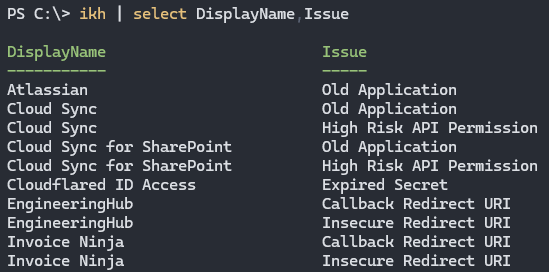

# Kari 狩り

Simple and efficient Suspicious App Hunter for Microsoft Tenants.

## Overview

Kari is a PowerShell Module designed to detect suspicious and stale Enterprise Applications in your Microsoft tenant. It helps identify potential security risks by analyzing apps based on a predefined criteria. This provides administrators a way to maintain a secure environment, by flagging apps that require investigation or review.



## Usage

Kari relies on the [Microsoft Graph PowerShell Module](https://learn.microsoft.com/en-us/powershell/microsoftgraph/installation), so it's up to you to install it first. You'll also need to authenticate to your preferred tenant using the following command:

```powershell
Connect-MgGraph -Scopes 'Directory.Read.All'
```

You can then install and run Kari:

```powershell
Install-Module Kari
Invoke-KariHunt
```

For more help and examples, use `Get-Help`.

```powershell
Get-Help Kari
```

## What we hunt for

Kari hunts for a range of indicators that could suggest an app is suspicious, or potentially malicious. These indicators are based on common traits observed in rogue, unused, unapproved and potentially unwanted applications.

Kari looks for, but is not limited to, the following indicators:

- Known [Rogue Applications](https://huntresslabs.github.io/rogueapps/)
    - Also known as "TraitorWare"
- Names with "temporary" style keywords.
    - Such as `test`, `dev`, `trial`, etc.
- Names less than 3 characters long.
- Names that match an owners UPN
    - i.e. `user@domain.com`
- Apps with expired secrets and certificates.
- Apps with suspicious permissions.
    - `Directory.ReadWrite.All`, `User.ReadWrite.All`, `Group.ReadWrite.All`, etc.
- And more...

> [!IMPORTANT]
> These indicators do not definitively label an app as _malicious_. They are simply flags for further investigation by an administrator.
> Always review flagged apps carefully before taking any action to avoid disrupting legitimate services.

## Future Mitigation

By default Microsoft lets any user consent and register to apps, which can lead to many risks and issues. The best way to mitigate these is to restrict app permissions to only trusted users or none at all. All apps can (and probably should only) be registered by IT administrators, with approvals handled through an established process. On top of this, all Enterprise Apps should also be regularly reviewed, audited and cleaned up if no longer needed or suspicious.

- [Microsoft Learn | Configure how users consent to applications](https://learn.microsoft.com/en-us/entra/identity/enterprise-apps/configure-user-consent)
- [Microsoft Learn | Configure the admin consent workflow](https://learn.microsoft.com/en-us/entra/identity/enterprise-apps/configure-admin-consent-workflow)
- [Microsoft Learn | Grant tenant-wide admin consent to an application](https://learn.microsoft.com/en-us/entra/identity/enterprise-apps/grant-admin-consent)

## Contributing

Kari was only really written out of necessity. If you'd like to contribute, please feel free to submit issues or pull requests! We welcome any suggestions for improvements, additional features, or bug fixes.

After pulling the repository, you can bootstrap the development dependencies using the provided `bootstrap.ps1` script:

```powershell
.\scripts\bootstrap.ps1
Invoke-PSake test
```

## References

- [Microsoft Learn | Investigate and remediate risky OAuth apps](https://learn.microsoft.com/en-us/defender-cloud-apps/investigate-risky-oauth)
- [AppGov Score Blog | Removing Stale App Registrations](https://www.appgovscore.com/blog/entra-id-app-registration-enterprise-app-cleanup)
- [T-minus365 | Find Risky Apps in Microsoft 365](https://tminus365.com/find-risky-apps-in-microsoft-365/)
- [Varonis | Using Malicious Azure Apps to Infiltrate a Microsoft 365 Tenant](https://www.varonis.com/blog/using-malicious-azure-apps-to-infiltrate-a-microsoft-365-tenant)
- [Guardz | Abusing Entra ID App Registrations for Long-Term Persistence](https://guardz.com/blog/abusing-entra-id-app-registrations-for-long-term-persistence/)
- [Huntress Blog | Never Just One Termite](https://www.huntress.com/blog/never-just-one-termite-6-months-of-researching-oauth-application-attacks)
- [Huntress Labs | Rogue Applications](https://huntresslabs.github.io/rogueapps/)

### Alternatives

- [GitHub | HuskyHacks/cazadora](https://github.com/HuskyHacks/cazadora)
    - NOTE: Uses Python and Device Code Auth flow.

## Disclaimer

Kari is provided "as is" without warranty of any kind. We are not responsible for any damage or data loss that may occur from using this tool. Always review and test scripts in a safe environment before deploying them in production.

It should also be noted that Kari cannot definitively determine if an application is malicious or not. It simply highlights applications that meet certain criteria for further investigation by a human. Any unusual or suspicious activity originating from applications should be investigated thoroughly.
